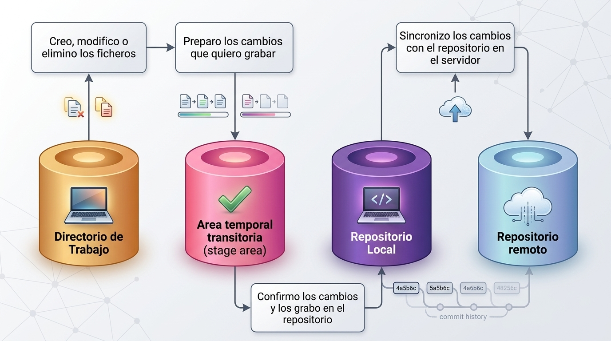

# Trabajo Individual

Ariel Edmilzon Luna Tudela  
Ing de sistemas

# Clase 1 HISTORIA
### Que es git?

Es un sistema de control de versiones Distribuido   
Nos permite guardar archivos y las versiones de estos a lo largo del tiempo de manera local 

### Como nacio git?
El creador es Linus Torvalds 
Durante anios, el desarrollo del kernel de linux utilizo un software llamado BitKeeper. Aun que era propiedad de una empresa, permitia que el proyecto de linux lo usara gratis

En 2005, la relacion entre la cominudad de linux y la empresa de bitkeeper se rompio despues de que un desarrollador intantara hacer ingenieria inversa al software. Bitkeeper retiro la licencia gratuita

Linus Torvalds busco alternativas, pero ninguna cumplia con sus estandares de velocidad y descentralizacion. Bajo la prmisa de "Si quieres algo bien echo, Hazlo tu mismo", Decio crear su propio Sistema

Lo llamo Git (Que significa persona desagradable o tonto) bromeando con que el mimsmo era un egocentrico y bautizaba todos sus proyectos con nombres que lo reflejaran 

### Como instalar git ?
Mi sistema operativo es Linux Mint 
```
sudo apt install git
```
### Configuraciones Basicas?
```
git config --global user.name "Nombre"
git config --global user.email "@correo.com"
git config --global core.autocrlf true
```

### Archivos que todo repositorio deberia tener
1. Readme.md
2. .gitignore


# Clase 2 STATES Y COMMITS 

## Los Estados de git
* Directorio de trabajo (modificado):
  Tu carpeta local. Estas escribiendo codigo, pero git aun no lo tiene "asegurado"
* Stage Area (Preparado): El area de espera. Les dices a Git: "Esto es lo que quiero guardar".
* Repositorio local(Confirmado): El historial. Tus cambios ya tienen un id(hash) y son parte de la historia



### Directorio de Trabajo (Modificado )
 Para volver a un estado original es decir q pase de "Modified" a su estado original 
 ```
 git restore <archivo>
 ```
 Borra fisicamente lo que se escribio 

Si no quiero q el archivo q cree lo vea git  
Lo que debes hacer es agregar el nombre eb el .gitignore 

### Stage Area (Preparado)
Permite seleccionar que archivos modificados se incluiran en el sigueinte commit y cuales no 
paraq traer un archivo al stage 
```
git add <archivo> -> agreaga un archivo especifico 
git add . -> agrega todos los archibos obseravados por git
```  

Si quieres sacar un archivo del stage area para vovler al estado anterior  

```
git restore --staged <archivo>
```

### Repositorio Local (Confirmado)
Esta es la ultima fase, qui es donde le decimos al reporotiro que cree el punto de guardado para que todos los cambios que esan en staged pasen a assre parte del historial.
```
git commit -m "mensaje"
```
Si quieres deshacer el ultimo commit 
```
git reset --soft HEAD~1
```

## Buenas Practicas 
### Cada cuanto debo hacer un commit?
Aqui usaremos los commits atomicos, son una paractica en git donde cada confirmacion(commit) represanta un unico cambio logivo, pquenio y completo en el codigo fuente 
A menudo es mejor, haceer commits pequenios, agrupando peuqnias m,ejoas o acciones, que un commit con todo lo que se quere hacer.

### Escribe buenos commits 
1. Usa verbos imperativos
    * Add: significa qie se aniade un nuevo archivo 
    * Change: Significa que se modifica un archivo existente 
    * Fix: Significa que se arregla un bug
    * Remove: Significa que se elimina un archivo existente
2. No uses punto final ni puntos suspensivos en tus mensajes 
3. Usa como maximo 50 caracteres 
4. Usa prefijos para tus commits para hacerlos mas semanticos   
    * Feat: Para ahcer una nueva caracteristica para el ususario 
    * fix: para un bug que afecta al usuario 
    * perf: para cambios que mejoran el rendimiento del sitio 
    * build: para cambios en el sistema de build, tareas de despliegue o instalacion 
    * ci: para cambios de integracion continua 
    * docs: para cambios en la documentacion 
    * refactor: para refactorizacion del codifgo como cambios de nombre variables o funciones 
    * style: para cambios de formato, tabulaciones espacion o punto y coma, etc, no afectan al ususario 
    *test: para tests o refactorixacion de uno ya existente 
5. Aniado todo el contexto que sea necesario en el cuerpo del commit
```
git commit -m “<tipo de prefijo>: <verbo imperativo descripción>”
```
