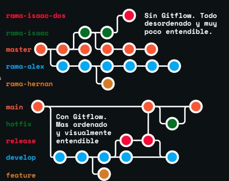

# Trabajo Individual

Ariel Edmilzon Luna Tudela  
Ing de sistemas

# Clase 1 HISTORIA
### Que es git?

Es un sistema de control de versiones Distribuido   
Nos permite guardar archivos y las versiones de estos a lo largo del tiempo de manera local 

### Como nacio git?
El creador es Linus Torvalds 
Durante anios, el desarrollo del kernel de linux utilizo un software llamado BitKeeper. Aun que era propiedad de una empresa, permitia que el proyecto de linux lo usara gratis

En 2005, la relacion entre la cominudad de linux y la empresa de bitkeeper se rompio despues de que un desarrollador intantara hacer ingenieria inversa al software. Bitkeeper retiro la licencia gratuita

Linus Torvalds busco alternativas, pero ninguna cumplia con sus estandares de velocidad y descentralizacion. Bajo la prmisa de "Si quieres algo bien echo, Hazlo tu mismo", Decio crear su propio Sistema

Lo llamo Git (Que significa persona desagradable o tonto) bromeando con que el mimsmo era un egocentrico y bautizaba todos sus proyectos con nombres que lo reflejaran 

### Como instalar git ?
Mi sistema operativo es Linux Mint 
```
sudo apt install git
```
### Configuraciones Basicas?
```
git config --global user.name "Nombre"
git config --global user.email "@correo.com"
git config --global core.autocrlf true
```

### Archivos que todo repositorio deberia tener
1. Readme.md
2. .gitignore


# Clase 2 STATES Y COMMITS 

## Los Estados de git
* Directorio de trabajo (modificado):
  Tu carpeta local. Estas escribiendo codigo, pero git aun no lo tiene "asegurado"
* Stage Area (Preparado): El area de espera. Les dices a Git: "Esto es lo que quiero guardar".
* Repositorio local(Confirmado): El historial. Tus cambios ya tienen un id(hash) y son parte de la historia


### Directorio de Trabajo (Modificado )
 Para volver a un estado original es decir q pase de "Modified" a su estado original 
 ```
 git restore <archivo>
 ```
 Borra fisicamente lo que se escribio 

Si no quiero q el archivo q cree lo vea git  
Lo que debes hacer es agregar el nombre eb el .gitignore 

### Stage Area (Preparado)
Permite seleccionar que archivos modificados se incluiran en el sigueinte commit y cuales no 
paraq traer un archivo al stage 
```
git add <archivo> -> agreaga un archivo especifico 
git add . -> agrega todos los archibos obseravados por git
```  

Si quieres sacar un archivo del stage area para vovler al estado anterior  

```
git restore --staged <archivo>
```

### Repositorio Local (Confirmado)
Esta es la ultima fase, qui es donde le decimos al reporotiro que cree el punto de guardado para que todos los cambios que esan en staged pasen a assre parte del historial.
```
git commit -m "mensaje"
```
Si quieres deshacer el ultimo commit 
```
git reset --soft HEAD~1
```

## Buenas Practicas 
### Cada cuanto debo hacer un commit?
Aqui usaremos los commits atomicos, son una paractica en git donde cada confirmacion(commit) represanta un unico cambio logivo, pquenio y completo en el codigo fuente 
A menudo es mejor, haceer commits pequenios, agrupando peuqnias m,ejoas o acciones, que un commit con todo lo que se quere hacer.

### Escribe buenos commits 
1. Usa verbos imperativos
    * Add: significa qie se aniade un nuevo archivo 
    * Change: Significa que se modifica un archivo existente 
    * Fix: Significa que se arregla un bug
    * Remove: Significa que se elimina un archivo existente
2. No uses punto final ni puntos suspensivos en tus mensajes 
3. Usa como maximo 50 caracteres 
4. Usa prefijos para tus commits para hacerlos mas semanticos   
    * Feat: Para ahcer una nueva caracteristica para el ususario 
    * fix: para un bug que afecta al usuario 
    * perf: para cambios que mejoran el rendimiento del sitio 
    * build: para cambios en el sistema de build, tareas de despliegue o instalacion 
    * ci: para cambios de integracion continua 
    * docs: para cambios en la documentacion 
    * refactor: para refactorizacion del codifgo como cambios de nombre variables o funciones 
    * style: para cambios de formato, tabulaciones espacion o punto y coma, etc, no afectan al ususario 
    *test: para tests o refactorixacion de uno ya existente 
5. Aniado todo el contexto que sea necesario en el cuerpo del commit
    ```
    git commit -m “<tipo de prefijo>: <verbo imperativo descripción>”
    ```

# Clase 3 GITHUB Y SSH

## Que es Github?
Github es una plataforma en la nube y red social para desarrolladores que permite alojar, gestionar y colaborar en  proyectos de software utilizando git.

## Git vs Github 
Git es el; sistema de control de versiones que crea los puntos de guardado, y github es el servidor donde esos puntos se almacenan y se socializan con el mundo, Github usa GIt mas no son lo mismo

## SSH vs HTTPS
### HTTPS 
Cuando clonamos y queremos usar un repositorio con https, este n os pedira autentiocarnos cada vez, hasta pindiendo un token. lo cual hace que sea cansado y molesto.
### SSH
Configuramos nuestra ps/laptop ssh para comunicarnos con github, mediante un key la cual al ponerla en github no necesitara pedirnos autenticarnos cada vez

# Clase 4 Remote SSH Multiple y checkout 
## Git remote 
  Git remote: es el comando que nos permite gestionar nuestras coneccinexiones con los rempositoprios remotos, le dice a git local donde enviar o de donde traer la informacion, algunos comando utile son 
  * git remote -v (Nos permite ver las URLs exactas donde
  apunta nuestro repositorio)
  * git remote add <apodo> “url” (Vincula nuestro repo local
  con uno en la nube.)
  * git remote set-url <apodo> “url” (Cambia la url donde
  apunta nuestro repositorio)

## Mutioples SSH 
Si tenemos mas de una cuenta de github o necesitamos tener otras cuentas es util tener mas de una llave ssh, pues esa no da acceso a cada cuenta, es un tunel, pero cada cuenta necesita su tunelpara que estos no choquen.

Es cmo tener una lalve para cada puerta, una no abre otra, su unba llave abre multiples puertas quiza deberiamos reconsiderar los cerrojos

## Git Checkout 
Es el comando que nos permite desplazarnos el HEAD hacia un punto especifico de la historia o una raman distinta 

### Para que sirve? 
* inspecciones: ver como era el codigo en un comit antiguo 
* Restaurar: recuperar archivos que borramos o cambiamos
* Experimentar: Probar cambios sin arruinar la rama principal 
* Cambiar: Saltarnos de una rama a otra 

### El estado "Detached HEAD" 
Normalmente, el HEAD apunta a una Rama( que se mueve), EN este estado desacoplado, El HED apunta directamente a un commit (que sea fijo)

###### Que queire decir ?
* Eres un espectador en el pasado 
* Puedes ver todo y escribir notas, pero no tienes el cuero 
* Si te vas al presenta sin encarnar en una rama tus cambios se pierden en el vacio 

#### Como ir y volver de un commit?
```
git checkout <hash_antiguo> -> para ir atras

git checkout <rama> -> para volver al ultimo hash de la rama

Si hiciste algo aca (como un commit)
git checkout <hash_commit_creado>
git checkout -b rama_nueva
```

## Buenas practicas 
* No trabajes mucho tiempo den Detached HEAD
* Limpia tu directorio de trabajo 
* Usalo para aprender 

# Clase 5 Ramas y gitflow basico 

## Que son las ramas? 
Las ramas son una de las principales utilidades que disponemos en git para llevar un mejor control de codigo, Se trata de una bifurcacion del estado del codigo que crea un nuevo camino de cada a la evolucion del codigo en paralelao a otras ramas que se puedan generar 

## Branch 
  git branc es un comando q nos permite gestionar las ramas que tiene o tendra nuetra proyecto, esto en base a distintos comandos 

  ```
  git branch -> lista las ramas disponibles y nuetro posicionaminto actual de nuestro HEAD

  git branch <rama> -> Crea una rama a partir de la rama en la que etsamos posicionamos

  git branch -D <rama> -> borra la rama
  ```
## Git checkout enfocado en ramas
Si bien lo suamos preciemnte para ver nuestros archivos pasados mediante los commits, tambien puede ser usado junto con las ramas 
```
git checkout <rama> -> cambia de rama (todo tiene q estar comiteado para esto )
git checkout -b <rama> -> crea la rama y te mueve a ella 
```

## Git checkout vs git switch 
##### Por que existen ambos ?
Originalemnte, git checkout estaba sobrecargado: servia para cambiar de rama, viajar a comits antoguos y restaurar archivos. En 2028 se introdujo git switch para separar la navegacion de ramas del resto de funciones, haciendo un flujo mas seguro e intuitivo 

git checkout es multiproposito pero puede derate en Detached HEAD facilmente, es el comando clasico y universal. Git switch esta especializado unicamente en ramas y evita errores accedentales al moverte, es el comando moderno desde 2019

## Git flow basico 
### Que es ?
Es un flujo de trabajko (workflow) el cual no9s permite trabajar de manera ordenada nuestras ramas, pues atravez de ciertas consginas y reglas establecidasm nos permite trabajar ordenadamente con ramas, versiones, y permite una facil adaptacion para cualquiera que quiera aportar en nuestro proyecto, muy util sibre todo en SCESI 


### Como funciona gitflow?

* ###### Main 
Como siempre hasta ahora tenemos la rama main la cual es la que tenemos por defecto al crear un repositorio de git, el proposito de esta rama es contener el codigo que se encuentra en produccion 
* ###### develop 
Es la rama de pre-produccion. Su proposito es tener las caracteristicas que sen probando mas todavia no han sido validadoes del todo, pero que seran lanzadas a produccion pronto. Es donde mas trabajaran a lo largo del proyecto 
* ###### Ramas de apoyo 
Son ramas que nos permitiras escribir nuestro codigo y estas pueden ser feature release y hotfix 

  * feature : Caundo trabajas en una nueva caracteristica para el proyecto. Estas ramas se crean a partir de la rama develop
  * realease Cuando preparas el lanzamiento de una nueva version. Es en teoria donde se hace pruebas de (QA) se crean en develop y se fusionana en develop o main 
  * Hotfix: para trabajar en cambios improvistos como parques para arreglar un bug o un problema en producccion